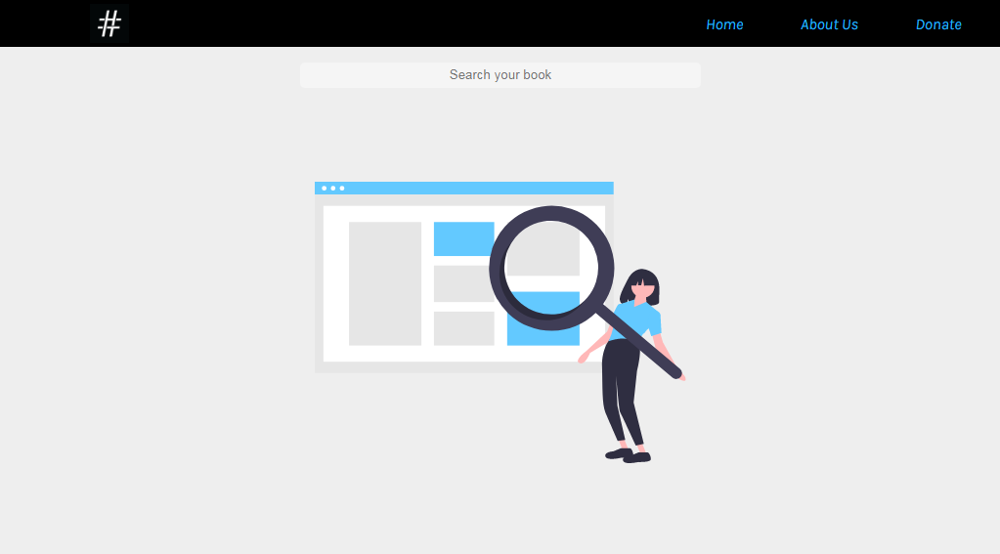
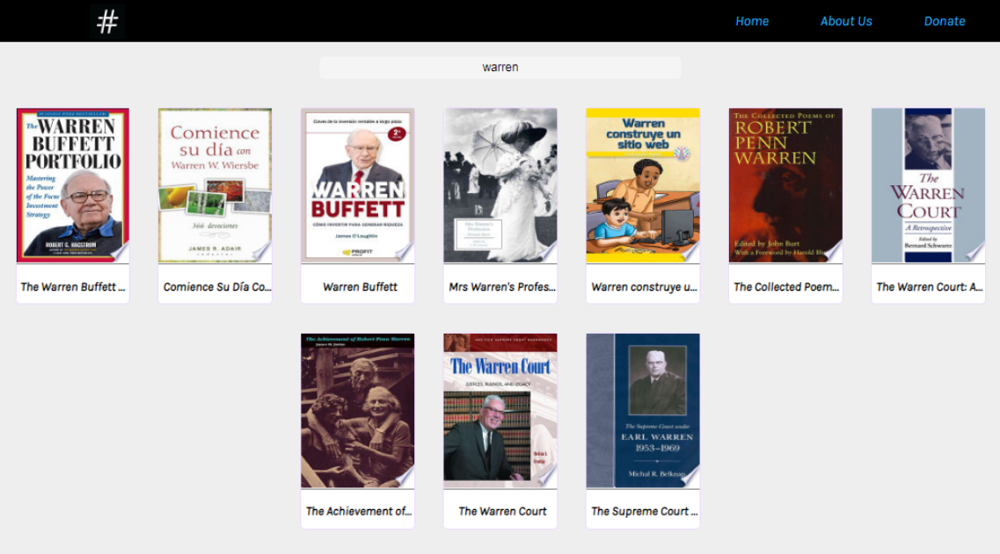

# Simple Book App

### Demo:
https://happy-swartz-61528a.netlify.app/

In the project directory, you can run:

### `npm install`

to install all of the necesary to run this project in your text editor

### `npm start`

Runs the app in the development mode. 
Open [http://localhost:3000](http://localhost:3000) to view it in the browser.
The page will reload if you make edits. 

